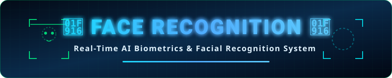

<div align="center">

<!-- Animated Shields & Badges -->
<p align="center">
  
  
  
  
  
  <a href="https://github.com/rahulae1616-rgb/face-recognition-app">
    
  </a>
</p>

<br>

<!-- Live Animated Title Banner Image -->
<a href="https://github.com/rahulae1616-rgb/face-recognition-app">
  
</a>

<br>
<br>

> 🔍 **Face Recognition Full-Stack App** is an AI biometrics solution engineered with **React (Vite)**, **Express.js**, **MongoDB Atlas**, and **face-api.js** (TensorFlow.js). Users can register faces via webcam and perform instant 128-dimensional facial embedding matching against a stored vector database.

</div>

---

## ⚡ Key Highlights

- 🎥 **Real-Time Webcam Scan:** Live facial landmark tracking and biometric scanning right in the browser.
- 🧠 **TensorFlow.js & SSD MobileNet V1:** High-accuracy face detection model with 128-D vector extraction.
- 💾 **Persistent Vector Storage:** MongoDB integration for storing user profile metadata & face embeddings.
- 💎 **Glassmorphic UI:** Modern UI crafted with React, Framer Motion, and Tailwind-inspired styling.
- 🐳 **Production Dockerized:** Includes Linux canvas native builds (`libcairo2`, `libpango`) ready for 24/7 cloud hosting on Render or GCP.

---

## 🏗️ Architecture & Data Flow

```
┌──────────────────────┐        Webcam Stream        ┌──────────────────────────┐
│  React (Vite) Frontend│ ────────────────────────>  │ Express + face-api.js    │
│  Framer Motion UI    │                            │ TensorFlow.js AI Model   │
└──────────────────────┘                            └────────────┬─────────────┘
                                                                 │
                                                   128-D Vectors │
                                                                 ▼
                                                    ┌──────────────────────────┐
                                                    │ MongoDB Atlas Database   │
                                                    │ User Profiles & Descriptors│
                                                    └──────────────────────────┘
```

---

## 🚀 24/7 Production Cloud Deployment

To host this app online 24/7 with zero downtime:

### 1. **Database Setup (MongoDB Atlas)**
1. Register a free account at [MongoDB Atlas](https://www.mongodb.com/cloud/atlas).
2. Create a free shared cluster.
3. Whitelist Network IP `0.0.0.0/0` (allows cloud access).
4. Obtain your connection string:
   `mongodb+srv://<username>:<password>@cluster.mongodb.net/face_db`

### 2. **Render Cloud Hosting (Recommended)**
1. Connect your GitHub repository to [Render.com](https://render.com/).
2. Create a new **Web Service** selecting this repository.
3. Configure **Environment Variables**:
   - `MONGODB_URI`: Your MongoDB Atlas URI
   - `NODE_ENV`: `production`
   - `PORT`: `4000`
4. Render will detect the included [`Dockerfile`](Dockerfile) and build all C++ canvas dependencies automatically!

---

## 💻 Local Development Setup

### Prerequisites
- **Node.js 18+** (Node 20 recommended)
- **npm** or **yarn**

### 1. **Setup & Start Backend**
```bash
cd backend
npm install
npm run download-models
npm run dev
```
*Backend runs on `http://localhost:4000`*

### 2. **Setup & Start Frontend**
```bash
cd frontend
npm install
npm run dev
```
*Frontend runs on `http://localhost:5173`*

---

## 🛠️ Stack & Technologies

| Layer | Technology |
| :--- | :--- |
| **Frontend** | React, Vite, Framer Motion, HTML5 Canvas API |
| **Backend** | Node.js, Express.js, Multer |
| **AI / Machine Learning** | `@vladmandic/face-api` (TensorFlow.js backend) |
| **Database** | MongoDB & Mongoose |
| **Containerization** | Docker (`node:20-slim` + `libcairo2-dev`, `libgif-dev`, `pango`) |

---

## ⚠️ Notes & Requirements
- **Webcam HTTPS Rule:** Modern web browsers require HTTPS (or `localhost`) to access webcam video streams. Cloud services like Render automatically provide SSL certificates.
- **Canvas Binaries:** The provided [`Dockerfile`](Dockerfile) takes care of installing native C++ libraries required by `canvas` and TensorFlow on Linux environments.

---

## 👨‍💻 Author

Developed by **RAHUL CHANDRA**
- 🐙 **GitHub:** [@rahulae1616-rgb](https://github.com/rahulae1616-rgb)

---

## 📜 License

Distributed under the **MIT License**.
